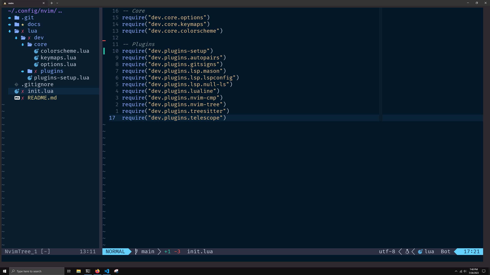
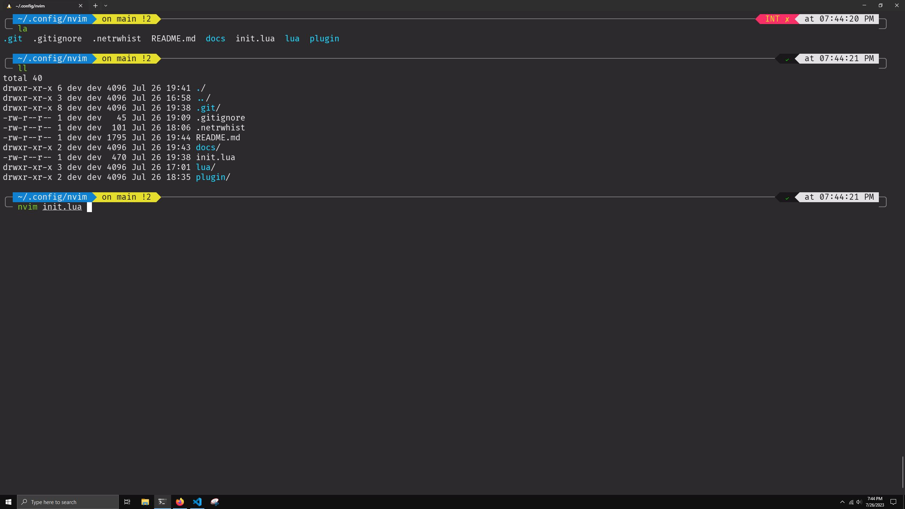

# Neovim Setup



## Pre-setup

### Zsh Shell



#### Windows Linux Subsystem

[Add Zsh](https://blog.joaograssi.com/windows-subsystem-for-linux-with-oh-my-zsh-conemu/)

In Windows Terminal app, open JSON settings and find "schemes", add this schema:

```json
{
   ...
   "schemes":
   [
       {
           "name": "Sonokai Shusia",
           "background": "#2D2A2E",
           "black": "#1A181A",
           "blue": "#1080D0",
           "brightBlack": "#707070",
           "brightBlue": "#22D5FF",
           "brightCyan": "#7ACCD7",
           "brightGreen": "#A4CD7C",
           "brightPurple": "#AB9DF2",
           "brightRed": "#F882A5",
           "brightWhite": "#E3E1E4",
           "brightYellow": "#E5D37E",
           "cursorColor": "#FFFFFF",
           "cyan": "#3AA5D0",
           "foreground": "#E3E1E4",
           "green": "#7FCD2B",
           "purple": "#7C63F2",
           "red": "#F82F66",
           "selectionBackground": "#FFFFFF",
           "white": "#E3E1E4",
           "yellow": "#E5DE2D"
      },
      ...
  ]
}
```

[Add PowerLevel10k Theme to Zsh](https://www.josean.com/posts/terminal-setup)

Download nerdfonts

[Website](https://www.nerdfonts.com/font-downloads)
[GitHub](https://github.com/ryanoasis/nerd-fonts)

> Note: On Windows, I needed extra setup to register the fonts. I need to search "Fonts", open "Font Settings", and drag'n drop the font zip to register it.

# References
- [Josean Martinez - YT](https://www.youtube.com/watch?v=vdn_pKJUda8&list=PLnu5gT9QrFg36OehOdECFvxFFeMHhb_07&index=3)
- [Josean Martinez - Github](https://github.com/josean-dev/dev-environment-files/tree/main)
- [Primeagen - YT](https://www.youtube.com/watch?v=w7i4amO_zaE)
- [Primeagen - Github](https://github.com/ThePrimeagen/init.lua/tree/masteryou)
